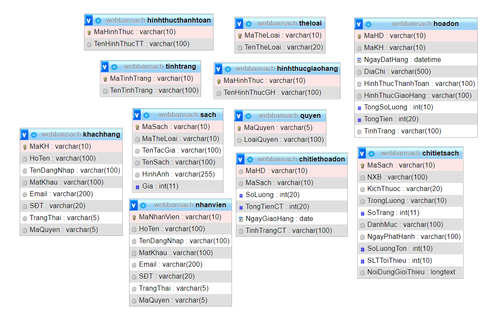

# Web 2 - Website bán sách


 

## Thành viên nhóm

| STT |    MSSV    | Họ và tên             |
| :-: | :--------: | --------------------- |
|  1  | 3119410420 | Hồ Tấn Thuận          |
|  2  | 3119410439 | Minh Hiếu Calan Tog   |

## Yêu Cầu:

- Xây dựng website có kết nối db và sử dụng ngôn ngữ php <br/>

## Database




## Hướng dẫn cài đặt

Phần mềm chạy tốt với độ phân giải màn hình chuẩn của máy là > 1280x900 ( FullHD )

```
1. Tạo database "webbansach" và import file "mysql/webbansach.sql" vào phpadmin trên XAMPP .
```

```
2. Chạy web bằng đường dẫn: "http://localhost/Web2/"
